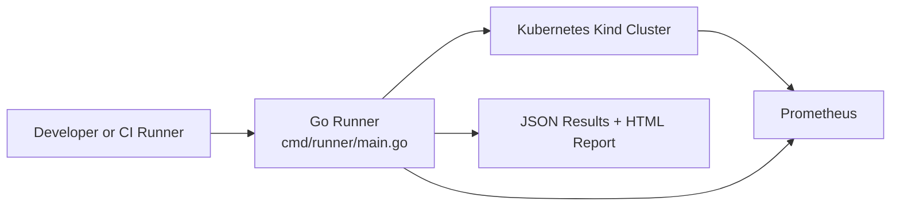
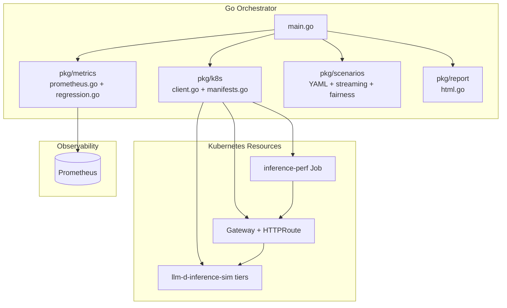
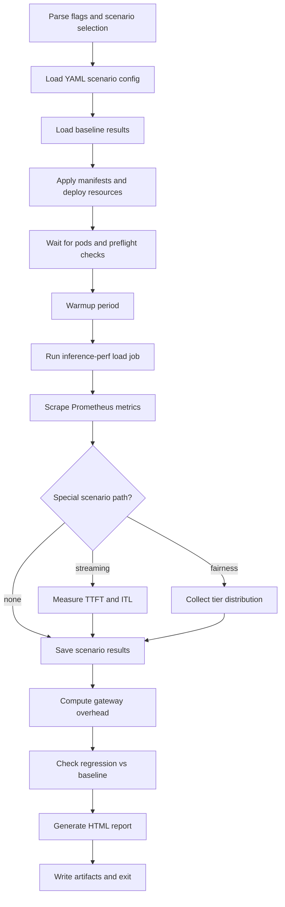
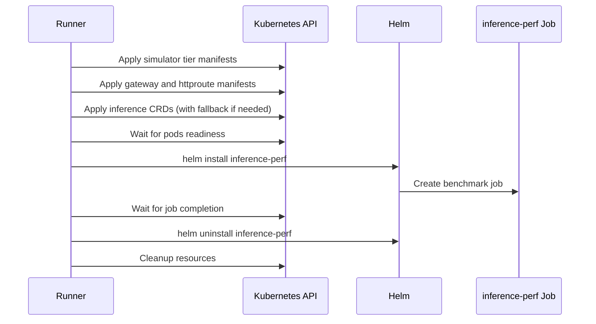
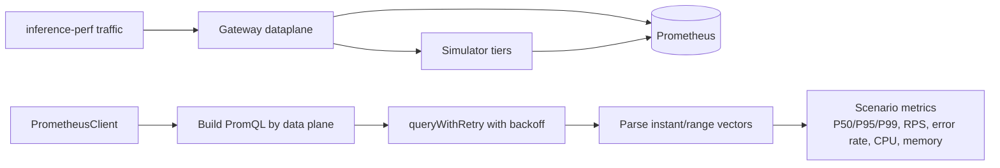
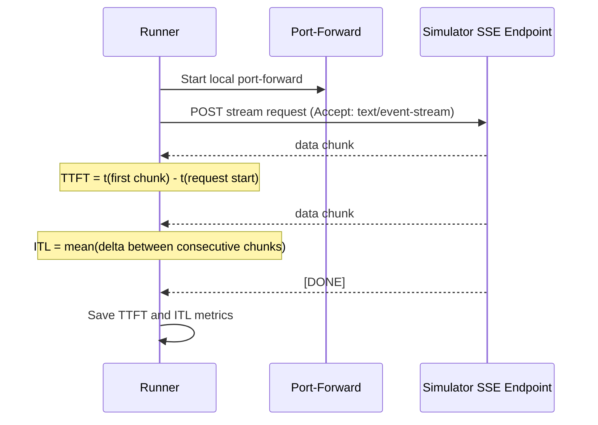
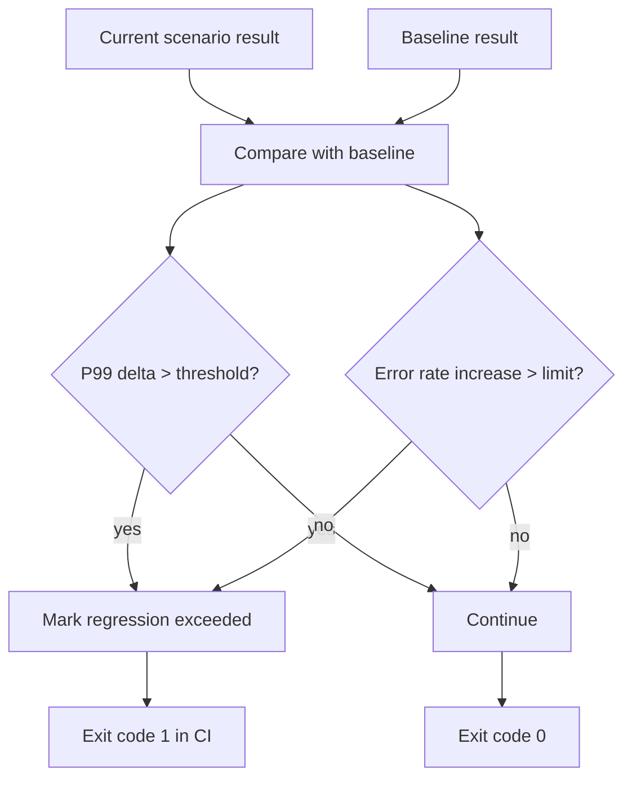
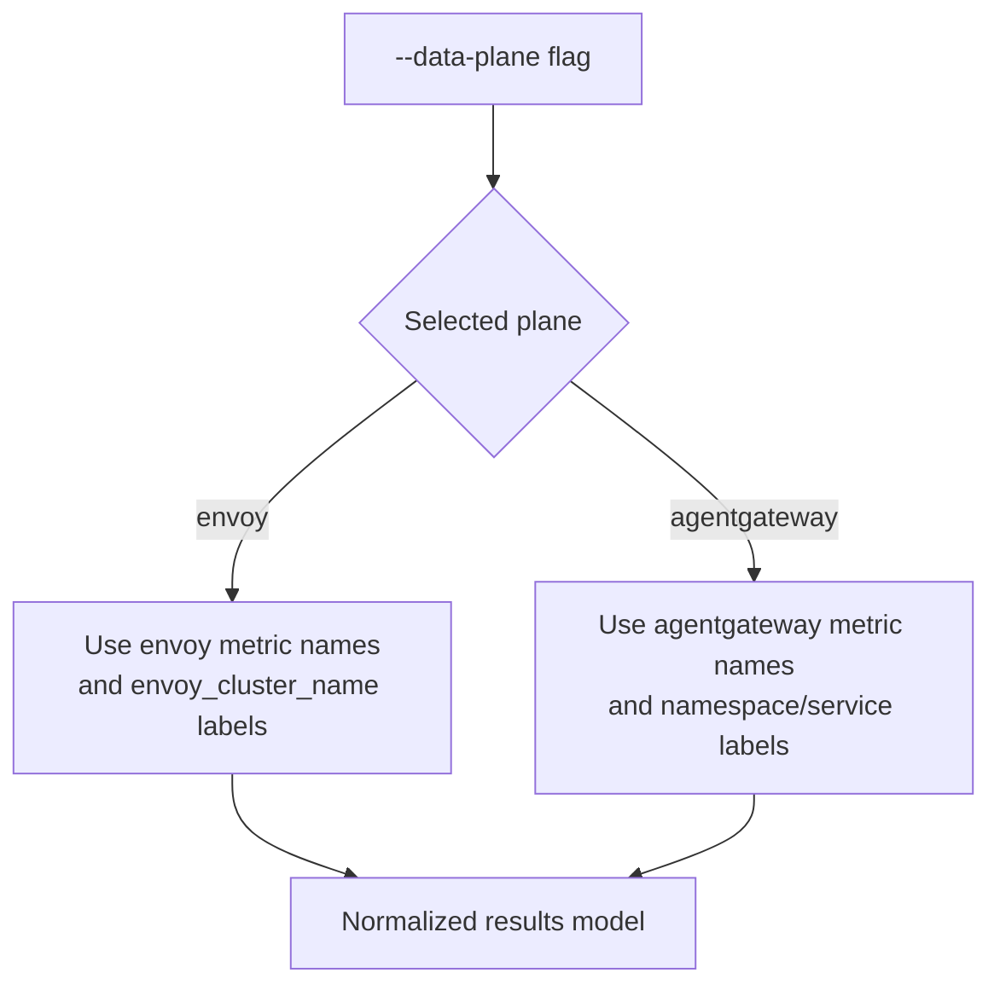
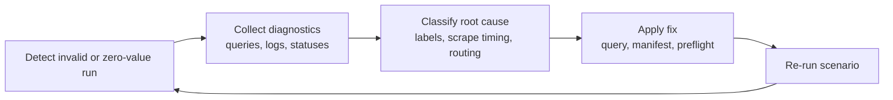

# Benchmarking Architecture

This document describes the architecture of the benchmarking framework under `benchmarking/`, its execution lifecycle, and the data/metric flows used for analysis and CI regression detection.

## 1. System Context

## 2. Core Components

## 3. End-to-End Scenario Lifecycle

## 4. Kubernetes Resource Orchestration

## 5. Metrics Collection Pipeline

## 6. Streaming TTFT/ITL Measurement Path

## 7. Regression and CI Decision Flow

## 8. Data-Plane Query Abstraction

## 9. Failure Diagnostics and Hardening Loop

## Repository Mapping

- `cmd/runner/main.go`: Orchestration entrypoint and scenario lifecycle.
- `pkg/k8s/client.go`: Cluster waits, port-forward helpers, diagnostics.
- `pkg/k8s/manifests.go`: Manifest apply/delete and fallback handling.
- `pkg/metrics/prometheus.go`: PromQL building, retries, metric scraping.
- `pkg/metrics/regression.go`: Baseline I/O and regression checks.
- `pkg/scenarios/*.go`: Scenario definitions, validation, streaming/fairness logic.
- `pkg/report/html.go`: HTML report generation.
- `.github/workflows/benchmark.yaml`: PR and nightly CI workflow.

## Design Principles

- Keep orchestration, measurement, and reporting separated.
- Treat metric validity as a first-class concern (retries, guardrails, diagnostics).
- Support both Envoy and agentgateway through a shared abstraction.
- Keep scenario configuration YAML-driven for reproducibility.
- Optimize for CI reliability and actionable artifacts.