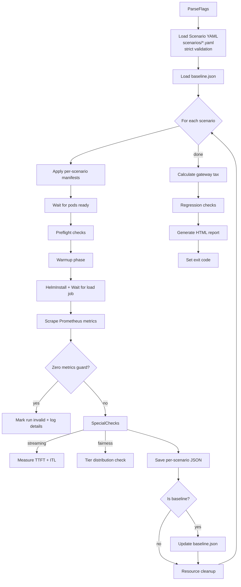

# GSoC 2026 Application — kgateway

---

**Project Title:** Benchmarking and Performance Evaluation of Inference Routing Extensions in kgateway

**Organization:** Cloud Native Computing Foundation (CNCF) — kgateway

**Applicant:** Rohan Dev

**Contact:** rohantech2005@gmail.com

**GitHub:** https://github.com/nxtcybernet

**LinkedIn:** https://linkedin.com/in/nxtcybernet

**Time Zone:** IST (UTC+05:30)

**Upstream Issue:** [kgateway-dev/kgateway#12289](https://github.com/kgateway-dev/kgateway/issues/12289)

**PoC Branch:** https://github.com/nXtCyberNet/kgateway/tree/test/test

**Primary Mentor:** Nina Polshakova — @npolshakova — nina.polshakova@solo.io

**Secondary Mentor:** Daneyon Hansen — @danehans — daneyon.hansen@solo.io

---

## Table of Contents

1. [Personal Information](#1-personal-information)
2. [University Enrollment](#2-university-enrollment)
3. [Proposal](#3-proposal)
   - 3.1 Abstract
   - 3.2 Motivation and Problem Statement
   - 3.3 Background: kgateway and Inference Routing Architecture
   - 3.4 Why This Problem Is Non-Trivial
   - 3.5 Goals and Non-Goals
   - 3.6 System Architecture Overview
   - 3.7 Benchmark Scenario Catalog (S1–S5)
   - 3.8 Go Orchestrator Design
   - 3.9 Observability and Metrics Collection Pipeline
   - 3.10 Regression Detection and CI Integration
   - 3.11 MIG Simulation via Heterogeneous Backend Tiers
   - 3.12 Streaming Metrics: TTFT and ITL
   - 3.13 Implementation Plan and Week-by-Week Timeline
   - 3.14 PoC Engineering Report
4. [About Me](#4-about-me)
5. [Why I Am the Right Candidate](#5-why-i-am-the-right-candidate)
6. [Open Source Contributions](#6-open-source-contributions)
7. [Implementation and Review Cadence](#7-implementation-and-review-cadence)
8. [Expected Outcome](#8-expected-outcome)
9. [Additional Notes](#9-additional-notes)

---

## 1. Personal Information

| Field | Value |
|---|---|
| Full Name | Rohan Dev |
| Email | rohantech2005@gmail.com |
| GitHub | https://github.com/nxtcybernet |
| LinkedIn | https://linkedin.com/in/nxtcybernet |
| Location | Faridabad, Haryana, India |
| Time Zone | IST (UTC+05:30) |
| University | Jawaharlal Nehru University, New Delhi |
| Program | B.Tech in Electronics and Communication Engineering |
| Year | Second Year |
| Expected Graduation | 2028 |

---

## 2. University Enrollment

I am currently enrolled as a second-year B.Tech student in Electronics and Communication Engineering at Jawaharlal Nehru University (JNU), New Delhi. My expected graduation date is 2028.

**Relevant coursework:** Computer Networks, Operating Systems, Cloud Computing, Linux Systems, Data Structures and Algorithms.

**Extracurricular roles:**
- Secretary — VOLT (Electronics Club), JNU
- Executive — LOOP (Development Club), JNU

I am available for the full GSoC coding period. This proposal is intentionally scoped as a medium project (~175 core engineering hours), and I can reliably dedicate 15-18 focused hours per week to meet that scope. I also have additional buffer availability during integration weeks, with no planned travel, exams, or academic obligations that would affect delivery.

---

## 3. Proposal

### 3.1 Abstract

kgateway provides inference routing capabilities based on the Kubernetes Gateway API Inference Extension project. This integration enables advanced behaviors such as model-aware routing, serving priority, and customizable load-balancing of self-hosted Generative AI models.

There is currently no standardized, reproducible, or CI-integrated way to evaluate the performance impact of these extensions. Maintainers have no automated mechanism to detect latency regressions introduced by code changes, and users have no published data on the overhead of enabling inference routing compared to plain gateway routing.

This proposal designs and implements a comprehensive benchmarking framework — written entirely in Go, operating natively on Kubernetes via `client-go` — that measures end-to-end latency (P50/P95/P99), throughput, and resource overhead across five representative scenarios. The framework produces per-scenario JSON artifacts, a standalone HTML dashboard (screenshot below), and CI-integrated regression checks — giving kgateway a reproducible, maintainer-mergeable, and extensible performance baseline.

**I have already built a fully functional proof-of-concept (PoC)** implementing the complete architecture described in this proposal. The PoC is live in my fork of the kgateway repository and has been run against a real Kind cluster. The primary known gap — zero Prometheus metrics in the baseline artifact — is a Prometheus scrape-window timing and metric label alignment issue, not a framework design flaw. Resolving it is the explicit first deliverable of Week 1.

---

### 3.2 Motivation and Problem Statement

When inference routing is enabled in kgateway, every inbound request passes through additional processing stages that standard HTTP routing does not require.

Request path:

1. Client request enters Envoy Listener (port 8080).
2. Request goes through `ext_proc` (gRPC, per-request body intercept).
3. `ExtProcRequest` parses JSON body to extract the `model` field.
4. Endpoint Policy Processor (EPP) reads KV-cache percentage, active requests, and prefix-cache hit rate from Prometheus, then writes destination endpoint headers.
5. Envoy selects upstream cluster endpoint.
6. Request reaches `llm-d-inference-sim` backend.

Each stage introduces measurable latency. Without a benchmarking framework, there is no way to quantify:

- The **gateway tax**: total P99 latency overhead of inference routing compared to direct routing.
- The **EPP scheduling latency**: time spent in the `ext_proc` -> EPP gRPC round-trip.
- The **streaming degradation**: impact on Time-to-First-Token (TTFT) and Inter-Token Latency (ITL) for Server-Sent Events (SSE) workloads.
- **Regression safety**: whether a code change introduces latency beyond an acceptable threshold.

This project closes these gaps with a reproducible benchmarking framework.

---

### 3.3 Background: kgateway and the Inference Routing Architecture

kgateway is built on KRT (Kubernetes Reactive Runtime), which uses a dependency-tracked computation graph. A change in one Kubernetes resource triggers recomputation only for dependent nodes, not a full recomputation of all resources. This design minimizes configuration churn latency.

The inference routing extension is based on the Kubernetes Gateway API Inference Extension and introduces three CRDs:

- **InferencePool**: defines a pool of inference endpoints serving a given model family.
- **InferenceModel**: maps a logical model name to a pool with serving priority.
- **InferenceObjective** *(experimental)*: expresses latency SLOs for serving priority tiers.

The data plane has two implementations:

- **Envoy-based** (default): Envoy with a Go `ext_proc` sidecar (EPP). Body parsing requires a context switch from Envoy to Go.
- **agentgateway**: Rust (Tokio) async proxy with in-process body parsing, removing the context switch.

The benchmarking framework must support both implementations and allow side-by-side comparison.

---

### 3.4 Why This Problem Is Non-Trivial

Benchmarking inference routing in kgateway is technically challenging for several reasons:

- **Metric attribution and multi-implementation support:** Envoy and agentgateway expose latency metrics under different namespaces and labeling schemes. The framework must correctly attribute metrics to the active data plane without cross-contamination in a shared cluster.

- **Prometheus scrape timing issues:** Metrics may not be immediately available at the end of a benchmark run due to scrape windows. The framework needs robust retry logic and zero-value detection to avoid false zero-latency results.

- **CRD version compatibility:** The upstream Kubernetes Gateway API Inference Extension CRDs evolve independently. The orchestrator must handle version drift gracefully while working around known schema limitations in Server-Side Apply.

- **Streaming workload measurement:** Standard Prometheus histograms cannot accurately capture Time-to-First-Token (TTFT) and Inter-Token Latency (ITL) for SSE streams. A dedicated SSE client is required alongside metric collection.

- **Non-deterministic EPP behavior:** The Endpoint Policy Processor makes routing decisions based on live runtime state (KV-cache, queue depth). Creating reproducible fairness tests requires carefully controlled simulator behavior to establish stable pressure gradients.

These challenges make a naive benchmarking script insufficient. A production-grade, maintainable framework must address all of them in a clean, extensible way.

---

### 3.5 Goals and Non-Goals

#### Goals

- Implement a fully reproducible benchmarking framework as a standalone Go module (`benchmarking/`) inside the kgateway monorepo.
- Define and execute five benchmark scenarios (S1–S5) covering baseline, header routing, full inference routing, SSE streaming, and EPP fairness.
- Collect P50, P95, P99, mean latency, throughput (RPS), gateway CPU (millicores), gateway memory (MiB), EPP decision latency (P99), TTFT (ms), ITL mean (µs), and ITL P99 (µs).
- Compute three explicit overhead metrics for each comparison point: pure gateway overhead (S2-S1), inference routing overhead (S3-S2), and total gateway tax (S3-S1).
- Detect P99 regressions and error-rate increases and fail CI when thresholds are exceeded.
- Produce per-scenario JSON artifacts and a standalone HTML dashboard.
- Support both Envoy and agentgateway data planes via a single `--data-plane` flag.
- Provide a `--stub` mode that validates the full reporting pipeline without a live cluster.
- Document benchmark methodology, results interpretation, known limitations, and contribution guidelines.

#### Non-Goals

- Absolute production capacity validation or stress testing at GPU scale.
- Full conformance testing of all Gateway API features.
- Multi-cluster orchestration or production-grade SLA-level load generation reliability.
- Replacing upstream [inference-perf](https://github.com/kubernetes-sigs/gateway-api-inference-extension/tree/main/tools/inference-perf) tooling — this framework orchestrates and wraps it.

---

### 3.6 System Architecture Overview

The benchmark framework is organized into four layers:

1. **Orchestration:** `cmd/runner/main.go` controls scenario execution end-to-end (setup, run, scrape, regression, report).
2. **Execution Layer:** inference-perf job generates traffic against kgateway (Envoy or agentgateway) with simulator backends.
3. **Metrics Layer:** Prometheus provides latency/resource metrics; a dedicated SSE client captures TTFT and ITL for streaming workloads.
4. **Output Layer:** the runner writes timestamped JSON artifacts, updates baseline references, and generates `report.html`.

Core modules:

- `pkg/k8s`: apply/delete manifests, Helm lifecycle, pod/job waits, port-forward.
- `pkg/metrics`: PromQL queries, retries, regression comparison.
- `pkg/scenarios`: YAML schema/validation, streaming and fairness helpers.
- `pkg/report`: standalone HTML report generation.

This architecture keeps execution, measurement, and reporting separated so the framework remains maintainable and extensible as new scenarios are added.

---

### 3.7 Benchmark Scenario Catalog (S1–S5)

The five scenarios form a stratified measurement ladder. Each layer adds one incremental variable relative to the previous one. This design enables precise attribution of the "gateway tax" to individual components of the inference routing extension.

```
S1: Baseline        S2: Header         S3: Inference      S4: Streaming
                Routing       ───▶ Routing        ───▶ (TTFT + ITL)
                (L7 only)          (EPP + body)
                                    │
                                    └──▶ S5: EPP Fairness
                                        (tier distribution)
```

#### S1 — Baseline (Control)

- **Purpose:** Establish the floor latency with no inference extension components active. This serves as the reference value for calculating gateway tax in all other scenarios.
- **Route path:** Direct-to-simulator (bypasses gateway) for pure backend baseline.
- `directToSimulator: true`
- `enableInferenceRouting: false`, `enableBodyParsing: false`
- Single tier: `tier-large` (2 replicas, 50 ms response delay, 0% KV cache)
- Load: 100 RPS for 120 seconds (10 concurrent users, 60 s warmup)
- **Key output:** `baseline.P99LatencyMs` — used as the anchor for all gateway tax calculations.
- **Current status:** The scenario executes successfully and generates output artifacts, but Prometheus metrics are currently returning zero values due to scrape timing and label alignment issues. Resolving this is one of the top priorities.

#### S2 — Header Routing

- **Purpose:** Measure pure L7 gateway overhead without any inference extension logic.
- **Route path:** Through gateway + HTTPRoute L7 routing.
- `directToSimulator: false`
- `enableInferenceRouting: false`, `enableBodyParsing: false`
- Identical backend configuration to S1.
- Load: 100 RPS for 120 seconds (10 concurrent users, 60 s warmup)
- **Delta vs S1:** Isolates the basic proxy and filter chain overhead.

#### S3 — Inference Routing (Primary Production Scenario)

- **Purpose:** Full end-to-end measurement of the inference routing stack under a heterogeneous backend fleet.
- `enableInferenceRouting: true`, `enableBodyParsing: true`
- Three tiers: `tier-large` (20 ms delay, 30% KV cache), `tier-medium` (45 ms delay, 60% KV cache), `tier-small` (80 ms delay, 80% KV cache)
- Load: 100 RPS for 120 seconds (20 concurrent users, 15 s warmup)
- **Delta vs S2:** Isolates the combined `ext_proc` gRPC round-trip + EPP scheduling latency. This represents the core value of the project.

#### S4 — Streaming (SSE)

- **Purpose:** Measure Time-to-First-Token (TTFT) and Inter-Token Latency (ITL) under inference routing with SSE workloads.
- `enableInferenceRouting: true`, `enableBodyParsing: true`
- Single tier: `tier-large` (50 ms delay, 20% KV cache, 2 replicas)
- Load: 20 RPS for 60 seconds (5 concurrent users, 10 s warmup)
- **Special measurement:** Uses a dedicated SSE Go client that timestamps each `data:` chunk arrival, since standard Prometheus histograms cannot accurately capture TTFT or ITL.

#### S5 — EPP Fairness

- **Purpose:** Validate that the Endpoint Policy Processor (EPP) distributes traffic proportionally according to backend capacity under controlled KV-cache pressure.
- `enableInferenceRouting: true`, `enableBodyParsing: true`
- Three tiers with asymmetric pressure: `tier-large` (50 ms, 10% KV cache), `tier-medium` (100 ms, 50% KV cache), `tier-small` (200 ms, 90% KV cache)
- Load: 50 RPS for 120 seconds (15 concurrent users, 15 s warmup)
- **Expected distribution:** Initial target band is approximately 70% / 20% / 10% (with ±5% tolerance), treated as a hypothesis rather than a fixed law.
- **Validation framing:** Distribution will be validated empirically in Week 4 against observed EPP behavior under controlled pressure gradients. If measured behavior consistently differs, the acceptance band will be revised to match documented scheduler behavior rather than forcing a post-hoc fit.
- **Failure mode:** A near-uniform 33/33/33 distribution would indicate that the EPP is ignoring capacity signals (dumb round-robin behavior).

#### Warmup Durations and Rationale

- **S1/S2 use 60 s warmup:** these are baseline control scenarios and must minimize cold-start effects to produce a stable reference.
- **S3/S5 use 15 s warmup:** inference-specific scenarios prioritize sampling under sustained routing pressure while keeping total CI runtime practical.
- **S4 uses 10 s warmup:** streaming probes are lower-RPS and short-lived; additional statistical controls (multiple probes, repeated runs) are used to reduce noise.
- **Safeguard:** If warmup tuning materially shifts P99 (>5%), the warmup is increased and recorded in scenario metadata to keep comparisons fair. This applies to all scenarios, including S3.

**Scenario Significance:**

| Scenario              | Focus                              | Risk if Measurement is Incorrect                  |
|-----------------------|------------------------------------|---------------------------------------------------|
| S1 Baseline           | Control reference                  | All gateway tax calculations become unreliable    |
| S2 Header Routing     | Pure L7 gateway overhead           | Cannot isolate proxy cost from inference cost     |
| S3 Inference Routing  | Full inference routing stack       | Core project value cannot be quantified           |
| S4 Streaming          | TTFT and ITL under streaming       | Streaming quality regressions go undetected       |
| S5 EPP Fairness       | Traffic distribution logic         | Scheduler quality issues remain hidden            |

All five scenarios have been implemented in the proof-of-concept. The core scenario logic is complete; only final wiring into the main orchestration loop remains pending.

---

### 3.8 Go Orchestrator Design

The orchestrator (`cmd/runner/main.go`) drives the complete lifecycle for each scenario, from flag parsing and manifest application to metrics collection, special checks, reporting, and regression validation.



**Key design decisions:**

- **YAML-first configuration.** Scenario parameters are defined in `scenarios/*.yaml` using strict decoding (`yaml.KnownFields(true)`). This ensures the YAML files remain the single source of truth and prevents silent configuration drift.
- **Data-plane abstraction.** Prometheus queries are parameterized based on the selected data plane (`envoy` or `agentgateway`) to handle different metric namespaces and labeling schemes.
- **Zero-metric guardrail (safety feature).** If core metrics (P50/P95/P99, throughput, error rate) return all zeros after scraping, the run will be marked invalid. This prevents invalid results from polluting regression comparisons or the baseline. This guardrail is not yet implemented in the current PoC but will be added as a critical safety feature before the project start.
- **Graceful teardown.** All applied resources are tracked and cleaned up in reverse order using `defer`, ensuring reliable cleanup even if a step fails midway.
- **Stub mode (`--stub`).** Allows full pipeline validation (reporting, JSON generation, HTML dashboard) locally without requiring a Kubernetes cluster or Prometheus.
    - In stub mode, the runner injects deterministic synthetic scenario outputs (latency percentiles, throughput, resource metrics, and optional TTFT/ITL samples) through the same aggregation and reporting path used in real runs.
    - Stub mode verifies schema compatibility, regression comparison logic, report rendering, and CI artifact generation; it does not claim data-plane performance accuracy.
- **Dynamic HTTPRoute `parentRef`.** The orchestrator automatically adjusts the `parentRef` in the HTTPRoute to match the active data plane gateway.

#### CLI Reference

Supported Flags:

- `--scenario`: Scenario to run (`baseline`, `header-routing`, `inference-routing`, `streaming`, `epp-fairness`, or `all`) — default: `all`
- `--data-plane`: Data plane under test (`envoy` or `agentgateway`) — default: `envoy`
- `--namespace`: Kubernetes namespace — default: `default`
- `--prometheus-url`: Prometheus HTTP API endpoint
- `--threshold`: P99 regression threshold in percent — default: `20`
- `--stub`: Enable synthetic mode (skips Kubernetes and Prometheus)
- `--verbose`: Enable detailed diagnostics (PromQL queries, vector samples, preflight checks)
- `--output`: Output directory for results and report

---

### 3.9 Observability and Metrics Collection Pipeline

Metrics collection is handled by a dedicated `PrometheusClient` in `pkg/metrics/prometheus.go` using the official `prometheus/client_golang` HTTP API. The client provides data-plane-specific query parameterization to correctly handle metric differences between Envoy and agentgateway.

**Core Metrics Collected:**

- **Latency Percentiles (P50/P95/P99):** Dynamically constructed queries scoped by data plane. Envoy uses `envoy_cluster_name`, while agentgateway uses `namespace` + `service` labels (with seconds-to-milliseconds conversion).
- **EPP Decision Latency:** P99 of the endpoint selection duration from `epp_endpoint_selection_duration_seconds_bucket`.
- **Error Rate:** Ratio of 4xx/5xx responses to total requests.
- **Gateway Resource Usage:** CPU (millicores) and memory (MiB) from container metrics for gateway pods.
- **Tier Distribution (S5):** Per-tier request percentages for validating EPP fairness under KV-cache pressure. Envoy (default data plane) support is prioritized in Week 4 and required for CI gating; agentgateway parity follows in the same reporting path.

**Retry Logic and Robustness:**

To address Prometheus scrape timing issues (where histograms may not yet contain fresh data points after a load job completes), all queries use an exponential-backoff retry mechanism (up to 3 attempts). Retries are triggered on query errors or missing samples, while valid zero-valued samples (for example, 0% error rate) are treated as legitimate results. A zero-metric guardrail, planned as a critical safety feature, will mark runs returning all-zero core metrics as invalid. This prevents polluted baseline values or misleading regression results.

Example of the retry helper:

```go
func (p *PrometheusClient) queryWithRetry(ctx context.Context, query string) (float64, error) {
    const attempts = 3
    var lastErr error
    missingSample := false
    for i := 0; i < attempts; i++ {
        val, hasSample, err := p.queryInstantWithStatus(ctx, query)
        if err == nil && hasSample {
            return val, nil
        }
        if err != nil {
            lastErr = err
        } else {
            missingSample = true
        }
        if i < attempts-1 {
            time.Sleep(time.Duration(math.Pow(2, float64(i))) * time.Second)
        }
    }

    if lastErr != nil {
        return 0, lastErr
    }
    if missingSample {
        return 0, ErrNoSample
    }
    return 0, fmt.Errorf("prometheus query retry exhausted without result")
}
```

**Design Highlights:**

- PromQL templates are centralized in the metrics package, making them easy to maintain and adapt when metric names or labeling changes in future kgateway or Inference Extension releases.
- Debug logging (behind `--verbose` flag) will output exact PromQL queries and returned vectors to help diagnose scrape or label alignment problems.
- The pipeline is designed for reliability and extensibility, directly addressing timing and zero-value issues observed during PoC runs. If retries exhaust with empty vectors, the client returns `ErrNoSample`, which is distinguishable from a legitimate zero metric.

---

### 3.10 Regression Detection and CI Integration

#### Regression Engine

The regression engine in `pkg/metrics/regression.go` compares results of each non-baseline scenario against the stored baseline. It computes relative P99 latency increase and absolute error-rate increase, then produces a `RegressionResult`.

To remove ambiguity, overhead metrics are computed with explicit scenario pairings:

| Metric | Formula | Purpose |
|---|---|---|
| Pure gateway overhead | `S2.P99 - S1.P99` | Isolates L7 proxy/filter cost without inference logic |
| Inference routing overhead | `S3.P99 - S2.P99` | Isolates `ext_proc` + EPP overhead above normal gateway routing |
| Total gateway tax | `S3.P99 - S1.P99` | End-to-end user-visible overhead versus direct baseline |

Each formula is computed and reported separately so maintainers can attribute regressions to the correct layer.

The default threshold is 20% for P99 latency regression (configurable via `--threshold`). If any scenario exceeds the threshold or shows a significant error-rate increase, the orchestrator exits with non-zero status, causing the CI job to fail.

A zero-metric guardrail (planned as a safety feature) will ensure that runs with invalid baseline or all-zero metrics are clearly marked and do not produce misleading regression results.

#### Baseline Lifecycle, Schema, and Invalidation

The baseline artifact (`baseline.json`) is treated as versioned benchmark state, not an opaque cache:

- **Storage policy:** The canonical baseline is committed in-repo for CI reproducibility; ad-hoc local runs can generate ephemeral baselines.
- **Metadata envelope:** baseline records include `kgatewayVersion`, `dataPlane`, `scenarioRevision`, `metricSchemaVersion`, `promqlTemplateHash`, and capture timestamp.
- **Staleness checks:** If `kgatewayVersion` or `metricSchemaVersion` differs from the current run, regression comparison is skipped with explicit "baseline incompatible" status.
- **Refresh workflow:** Baseline refresh is an intentional operation (manual dispatch + reviewer approval), not an automatic overwrite.
- **Refresh workflow:** Baseline refresh uses a dedicated `workflow_dispatch` job (`update-baseline`) that writes updated artifacts and opens a PR for maintainer review and approval.
- **Corruption guard:** CI validates baseline structure and required fields before using it; malformed baselines fail fast.

This prevents silent comparisons across incompatible metric labels or schema revisions.

#### Statistical Validity Plan

To reduce false conclusions from single-run P99 noise:

- **Repeated runs:** S1, S2, S3, and S5 execute at least 3 independent runs in CI-full mode.
- **Aggregation:** Use median-of-runs for P99 and report dispersion (min/max and coefficient of variation).
- **Outlier handling:** Flag runs outside 1.5x IQR for diagnostics; keep raw values in artifacts.
- **Cold-start control:** First run after cluster bootstrap is marked warmup-only unless variance is already within tolerance.
- **Confidence signal:** Regression gating uses both threshold exceedance and stability checks (for example, repeated exceedance in at least 2 runs).

This keeps the framework practical for CI while maintaining defensible benchmarking rigor.

#### CI Workflow

The project includes a GitHub Actions workflow (`.github/workflows/benchmark.yaml`) with two complementary jobs:

- **`benchmark-poc`** (triggered on every push/PR touching the `benchmarking/` directory):  
    Performs a fast sanity check by running the baseline scenario in a fresh Kind cluster. It validates the full pipeline (manifest apply, load generation, metrics collection, and report generation) and uploads JSON + HTML report as artifacts. This provides quick feedback (< 10 minutes) while keeping CI costs low.

    In the current layout, orchestrator and metrics code paths live under `benchmarking/**`, so this trigger covers functional benchmark changes. If benchmark-critical code is later moved outside this tree, workflow path filters will be expanded accordingly.

- **`benchmark-full`** (nightly cron or manual `workflow_dispatch`):  
    Runs the complete set of scenarios (or selected ones) for full regression testing across both data planes. Results are uploaded and a summary can be posted as a PR comment when triggered from a pull request.

**Manual dispatch inputs** allow flexibility:
- `mode`: `poc` | `full`
- `scenario`: specific scenario or `all`
- `data_plane`: `envoy` | `agentgateway`
- `threshold`: P99 regression threshold (default 20)
- `kgateway_version`: version to test

The split between fast PR checks and comprehensive nightly runs ensures both rapid feedback for contributors and thorough performance monitoring for maintainers. All workflows use `scripts/setup-kind.sh` for consistent cluster bootstrapping (Kind + CRDs + kgateway + Prometheus).

**Design Note:**  
The CI pipeline is designed to gracefully handle cases where baseline collection is still being stabilized, with clear logging and artifact upload even when some regression checks are skipped.

---

### 3.11 MIG Simulation via Heterogeneous Backend Tiers

To realistically test EPP routing decisions without requiring actual NVIDIA MIG (Multi-Instance GPU) hardware, the framework simulates different performance tiers that mimic real MIG slice behavior (3g.20gb, 2g.10gb, 1g.10gb).

Each tier is defined with configurable CPU/memory limits, response delay, and simulated KV-cache utilization percentage. This creates controlled pressure gradients so the Endpoint Policy Processor must make non-trivial routing choices based on live metrics rather than simple round-robin.

**Tier Mapping (MIG Analog):**

| Tier         | MIG Equivalent     | Response Delay | Simulated KV-Cache | Replicas |
|--------------|--------------------|----------------|--------------------|----------|
| tier-large   | 3g.20gb            | 20-50 ms       | 10-30%             | 2        |
| tier-medium  | 2g.10gb            | 45-100 ms      | 50-60%             | 2        |
| tier-small   | 1g.10gb            | 80-200 ms      | 80-90%             | 2        |

The simulator (`llm-d-inference-sim`) reports the configured KV-cache percentage to Prometheus, allowing the EPP to see realistic capacity signals. All tier parameters are defined in YAML, making it easy to adjust pressure gradients or add new tiers.

This simulation approach captures EPP behavior under load and stale-metrics scenarios while remaining fully compatible with Kind clusters. Transitioning to real MIG hardware later requires only updating resource requests/limits and pod labels - the rest of the benchmarking logic remains unchanged.

---

### 3.12 Streaming Metrics: TTFT and ITL

Standard Prometheus histograms only capture end-to-end request latency after the full SSE response has been received. For Server-Sent Events (SSE) inference workloads, this metric is misleading because it measures the time to stream *all* tokens rather than the user-perceived responsiveness - specifically **Time-to-First-Token (TTFT)** and **Inter-Token Latency (ITL)**.

The framework addresses this limitation by implementing a dedicated SSE client in `pkg/scenarios/streaming.go`. This client performs direct, accurate measurements of streaming quality under inference routing.

**Key Implementation Features:**

- Issues streaming requests with the required `Accept: text/event-stream` header to ensure the simulator returns chunked SSE responses instead of a buffered JSON response.
- Records the timestamp of the first `data:` chunk arrival for TTFT.
- Calculates ITL as the mean time delta between consecutive token chunks.
- Calculates ITL mean and ITL P99 from consecutive token chunk deltas.
- Runs multiple independent sampling probes per scenario and returns averaged results to reduce measurement noise and variance.

This direct measurement runs in parallel with Prometheus scraping, allowing side-by-side comparison between traditional latency metrics and true streaming performance. It is particularly valuable for detecting stream fragmentation or excessive buffering introduced by the `ext_proc` filter or EPP.

**Why This Matters:**
Many real-world Generative AI applications are highly sensitive to TTFT and ITL. Even small increases in these values can significantly degrade user experience. By measuring them accurately, the framework provides actionable insights into the true performance cost of enabling inference routing for streaming workloads (S4).

The streaming measurement logic is fully integrated into the scenario execution flow and designed to be extensible for future protocols such as WebSocket-based streaming or OpenAI-compatible delta streaming.

---

### 3.13 Implementation Plan and Week-by-Week Timeline

The proposal builds on a functional proof-of-concept that already implements the core orchestrator, scenario execution, metrics collection pipeline, HTML reporting, and all five benchmark scenarios. However, some areas - particularly measurement reliability (zero-value metrics due to Prometheus scrape timing and label alignment) and baseline accuracy - still need stabilization. The first few weeks are therefore focused on making metrics trustworthy before expanding features and CI integration.

This proposal is intentionally scoped as a medium-sized GSoC project (~175 core engineering hours). While I have additional weekly availability, that extra time is treated as risk buffer for review cycles, flaky CI reruns, and upstream integration feedback rather than scope inflation.

#### Week-by-Week Delivery Plan

**Week 1: Measurement Reliability**  
- Implement zero-metric guardrail to fail invalid runs early.  
- Add PromQL debug logging (`--verbose` flag) and Prometheus preflight checks.  
- Stabilize scrape timing issues observed in the PoC.  
- **Deliverable:** Scenarios produce trustworthy metrics or fail explicitly with clear diagnostics.

**Week 2: Baseline Refinement**  
- Improve baseline path to better isolate pure gateway overhead.  
- Validate and tune gateway tax calculation logic.  
- **Deliverable:** Reliable S1 baseline for accurate overhead measurements across all scenarios.

**Week 3: Data-Plane & Routing Improvements**  
- Make HTTPRoute `parentRef` fully dynamic based on the selected data plane.  
- Add route status and endpoint preflight checks.  
- **Deliverable:** Correct and robust routing for both Envoy and agentgateway. (PR 1)

**Week 4: Fairness Measurement Parity**  
- Implement Envoy-specific tier distribution query for S5.  
- Ensure consistent fairness reporting across both data planes.  
- **Deliverable:** Reliable EPP fairness validation. (PR 2)

**Week 5: Manifest & Namespace Hardening**  
- Make the framework namespace-portable.  
- Add richer failure diagnostics (logs, route status, key metrics).  
- **Deliverable:** More robust and portable benchmark execution. (PR 3)

**Week 6: Streaming Metrics Integration**  
- Integrate sampled TTFT and ITL measurement into S4.  
- Add TTFT P99 and ITL P99 reporting, with a separate streaming regression threshold keyed to percentile metrics.  
- **Deliverable:** Accurate streaming quality metrics. (PR 4)

**Week 7: Enhanced Reporting**  
- Add historical trend views and validity badges to the HTML report.  
- Improve result visualization and failure hints.  
- **Deliverable:** Maintainer-friendly, informative report. (PR 5)

**Week 8: CI Pipeline Stabilization**  
- Harden `benchmark-poc` and `benchmark-full` GitHub Actions workflows.  
- Improve retry logic and artifact management.  
- **Deliverable:** Stable CI with fast PR feedback and reliable nightly runs. (PR 6)

**Weeks 9-10: Testing & Code Quality**  
- Add unit and integration tests for all major components (including `--stub` mode).  
- Achieve >80% test coverage on core packages.  
- **Deliverable:** Solid test suite and clean codebase.

**Weeks 11-12: Documentation & Upstream Submission**  
- Finalize documentation (`README.md`, `ARCHITECTURE.md`, usage guide).  
- Prepare and submit the upstream PR to the kgateway monorepo with full benchmarking module.  
- Include representative benchmark results from a complete 5-scenario run.  
- **Deliverable:** Mergeable, well-documented contribution.

#### Acceptance Criteria

The project will be considered successfully completed when:
- All five scenarios produce meaningful, non-zero metrics in Kind clusters.
- Baseline (S1) and gateway tax calculations are reliable.
- Streaming metrics (TTFT/ITL) and fairness checks (S5) work correctly.
- Regression detection properly fails CI when thresholds are exceeded.
- The HTML report clearly shows results, overhead, and status for all scenarios.
- CI workflows run reliably on PRs and nightly.
- Core packages have >80% test coverage and pass linting.
- Full documentation and a high-quality upstream PR are delivered.

---

### 3.14 PoC Engineering Report

#### 3.14.1 Current PoC Snapshot

The PoC is implemented under the `benchmarking/` directory in my fork:  
[`nxtcybernet/kgateway/tree/benchmarking`](https://github.com/nxtcybernet/kgateway/tree/benchmarking).

The PoC is a compilable Go module under `benchmarking/` and already includes the end-to-end framework skeleton: scenario orchestration, Kubernetes/Helm lifecycle handling, Prometheus scraping, streaming measurement hooks, regression checks, JSON artifact generation, and HTML reporting. CI wiring (`benchmark-poc` and `benchmark-full`) and local Kind bootstrap scripts are also implemented.

In short, architecture and workflow are in place; the main remaining work is measurement stabilization rather than framework design.

Current status matrix:

| Component | Status |
|---|---|
| Scenario orchestration and execution | ✅ Complete |
| Artifact generation and HTML reporting | ✅ Complete |
| CI jobs (`benchmark-poc`, `benchmark-full`) | ✅ Complete |
| Retry robustness and no-sample signaling | ✅ Complete |
| Zero-metric guardrail enforcement | 🔧 In progress |
| Baseline governance automation (`update-baseline`) | 🔧 In progress |
| Streaming percentile gating in CI | 🔧 In progress |

Latest runner output (current blocker evidence):

```text
Run go run ./cmd/runner \
🚀 kgateway Inference Routing Benchmark Runner
    Data Plane : envoy
    Namespace  : default
    Threshold  : 20%

    ⚠️  Baseline not loaded (failed to read baseline results/baseline.json: open results/baseline.json: no such file or directory) — regression checks will be skipped

=== Running scenario: baseline ===
    Applying manifests...
    Waiting for 2 pod(s)...
    Warmup (60s)...
    Generating load (100 RPS for 120s)...
    Route mode: direct-to-simulator
    Chart path: /home/runner/work/kgateway/kgateway/benchmarking/helm/inference-perf
    Target Base URL: http://llm-d-sim-large.default.svc.cluster.local:8000
❌ Scenario baseline failed: helm install inference-perf: helm install "inference-perf" failed: exit status 1 (stderr: Error: path "/home/runner/work/kgateway/kgateway/benchmarking/helm/inference-perf" not found
```

Interpretation:

- The missing baseline file is expected on first run and only disables regression comparison for that execution.
- The blocking failure is Helm chart path resolution in CI; fixing chart-path discovery and adding preflight validation is a Week 1 priority.

#### 3.14.2 Execution Readiness and Stabilization Focus

The remaining work is focused on stabilization and production-hardening rather than new architecture. Early milestones prioritize metric validity checks, baseline consistency, and cross-data-plane parity so that the existing framework can be used as a reliable CI signal for maintainers.

This scope is already mapped to the Week 1 to Week 4 execution plan and is intentionally front-loaded before feature polish.

#### 3.14.3 Engineering Issues Already Solved

Several high-impact engineering blockers have already been resolved in the PoC:

- Added inference CRD version fallback logic (`v1alpha2` -> `v1`) to handle upstream version drift.
- Implemented fallback behavior for Server-Side Apply schema incompatibilities in inference manifests.
- Stabilized scenario execution flow with retries, waits, and diagnostics to avoid silent failures.

These fixes demonstrate that the implementation can absorb real upstream and CI environment variability.

#### 3.14.4 Evidence and Confidence Level

The pipeline is operational end-to-end: scenarios execute, artifacts are generated, reports render, and workflows run. Current metric anomalies are treated as measurement-validity tuning (timing/label alignment), not an architectural limitation.

Confidence is therefore high that the remaining work is bounded and execution-focused: metric reliability hardening, data-plane parity, and report/test polish.

---

## 4. About Me

I am a Cloud and DevOps Engineer and active CNCF contributor with hands-on experience building production-grade infrastructure systems in Go and Kubernetes. My work focuses on secure networking, custom controllers, observable platforms, and reproducible distributed systems — all skills that map directly to the kgateway benchmarking framework.

While my degree program is ECE, my self-directed engineering work and open source contributions are centered on systems software and cloud-native infrastructure, which is the direct skill profile this project requires.

### Key Personal Projects

**ForgePaaS — Self-Hosted Kubernetes-native Platform-as-a-Service**

GitHub: https://github.com/nXtCyberNet/ForgePaaS

Built a complete PaaS that lets developers build, deploy, and manage applications via CLI/API without external dependencies. Core architecture: custom Kubernetes controller (client-go), Redis state queue, Cloud Native Buildpacks build worker, local Docker registry, and transparent reverse-proxy ingress. Implemented a reactive dependency graph similar to kgateway's KRT engine — configuration changes only update affected nodes, minimizing reconcile storms during autoscaling. Developed full CLI tooling (`forge deploy`, `forge status`, `forge logs`) with real-time observability. Technologies: Go, Kubernetes (client-go), Helm, Redis, Buildpacks.

*Directly relevant because:* The KRT-style reactive graph, `client-go` controller patterns, and Prometheus+Grafana observability stack are exactly the technologies the kgateway benchmarking orchestrator uses.

**ForgeTunnel — Secure Application-Level TCP Tunneling System**

GitHub: https://github.com/nXtCyberNet/ForgeTunnel

Lightweight Go-based TCP tunneling system that securely exposes local services without VPNs. Implemented encrypted multiplexed streams over a single persistent connection using a custom protocol with packet batching and stream reuse for low-latency performance. Technologies: Go, custom protocol, encryption, multiplexed streams.

*Directly relevant because:* Building this gave me deep intuition for TCP/gRPC boundaries and proxy latency measurement — the same mental model needed to understand the `ext_proc` gRPC round-trip overhead that the benchmarking framework isolates.

**Multi-Client Auto Trading Bot Infrastructure (Freelance)**


Architected and deployed a containerized trading bot platform on GKE supporting 100+ concurrent isolated client instances. Solved real-world GKE autoscaling instability using manual cluster scaling and Kubernetes API-based provisioning. Integrated Redis for state tracking and a full Prometheus + Grafana observability stack. Technologies: Docker, Kubernetes (GKE), Redis, Prometheus, Grafana.

*Directly relevant because:* This gave me production experience measuring and benchmarking real workloads under load — directly transferable to the five benchmark scenarios and regression detection in the kgateway framework.

---

## 5. Why I Am the Right Candidate

The kgateway benchmarking framework requires a skill set I have already applied in production environments:

- Go-based orchestrator using `client-go` for Kubernetes interactions
- Kubernetes manifest management, readiness checks, and job lifecycle handling
- Prometheus metric scraping, histogram analysis, and PromQL construction
- Regression detection and baseline comparison logic
- Understanding of edge cases such as stale metrics, heterogeneous backends, and SSE streaming behavior

Most importantly, **I have already built a functional end-to-end proof-of-concept** in my fork at  
[`nxtcybernet/kgateway/tree/benchmarking`](https://github.com/nxtcybernet/kgateway/tree/benchmarking).  
It includes the full orchestrator, all five benchmark scenarios, Prometheus integration, MIG-style tier simulation, SSE measurement client, CI workflow, and HTML reporting. I have successfully run it against real Kind clusters.

The remaining work is primarily stabilization and hardening (as detailed in §3.13 and §3.14), not architectural discovery. This allows the GSoC period to focus on execution: improving measurement reliability, completing data-plane parity, strengthening tests, and preparing a high-quality upstream contribution.

### Skills Directly Relevant to This Project

| Skill | Evidence |
|---|---|
| Go | ForgeTunnel, ForgePaaS core, all CNCF PRs, kgateway PoC |
| Kubernetes / client-go | ForgePaaS controller, GKE production deployment, kgateway PoC |
| Prometheus / PromQL | GKE trading infra observability, kgateway metrics pipeline |
| Networking / gRPC | ForgeTunnel protocol, ext_proc gRPC understanding |
| Performance benchmarking | GKE production load measurement, kgateway gateway tax analysis |
| LLM inference domain | Self-hosted inference experiments, KV-cache / queue-depth metrics |

---

## 6. Open Source Contributions

I actively contribute to multiple CNCF projects, demonstrating my ability to identify issues, ship production fixes, and collaborate in large Kubernetes codebases:

**LitmusChaos (Chaos Engineering Platform)**
- Issues [#5460](https://github.com/litmuschaos/litmus/issues/5460) and [#5458](https://github.com/litmuschaos/litmus/issues/5458): Frontend build migration to pnpm and critical security risks in outdated Argo dependencies and CVEs.
- PR [#5459](https://github.com/litmuschaos/litmus/pull/5459): Security hardening of Docker base images and Go dependencies.

**Karmada (Multi-cluster Kubernetes Orchestration)**
- PR [#7300](https://github.com/karmada-io/karmada/pull/7300): "test: add inline event assertions for resource template events" (actively under review).

**OSCAL-Compass / compliance-trestle (NIST OSCAL Compliance Tooling)**
- PR [#2100](https://github.com/oscal-compass/compliance-trestle/pull/2100): CI hardening (virtualenv pinning + cache isolation).
- PR [#2080](https://github.com/oscal-compass/compliance-trestle/pull/2080): Continuous fuzzing for OSCAL catalog.
- PR [#2075](https://github.com/oscal-compass/compliance-trestle/pull/2075): Fix concurrent gh-pages deployments.

These contributions required deep understanding of Kubernetes controllers, CI/CD pipelines, security scanning, and observability — all core skills for this project.

---

## 7. Implementation and Review Cadence

I commit to the following working cadence for the duration of GSoC:

- **Weekly mentor check-in:** Sync with Nina and Daneyon every week to review progress, surface blockers, and align on upcoming work.
- **PR cadence:** One mergeable PR approximately every 2 weeks, following the kgateway PR template exactly: Description, `/kind feature`, `release-note` block. All PRs will be scoped small enough to be reviewable in a single session.
- **Communication:** Respond to review comments within 24 hours on business days. Post weekly status updates in the upstream tracking issue [#12289](https://github.com/kgateway-dev/kgateway/issues/12289).
- **Code quality:** All PRs will pass `make analyze`, `make fmt-changed`, and `go test ./...` before requesting review.
- **Availability:** I am available for the full 12-week coding period (June to August 2026). No planned travel or exams during this period.

In the event of an unexpected blocker (upstream API change, critical CI flakiness), I will surface the issue immediately in the weekly check-in and propose an adjusted plan rather than silently falling behind. The `TODO.md` in the repository tracks all P0/P1/P2 items and is the shared source of truth for execution status.

---

## 8. Expected Outcome

By the end of GSoC 2026, the kgateway project will have:

1. **A reproducible benchmarking framework** as a standalone Go module (`benchmarking/`) inside the kgateway monorepo, licensed under Apache 2.0 — mergeable and maintainable by the core team long after GSoC ends.

2. **Five benchmark scenarios (S1–S5)** covering the full spectrum from baseline to full inference routing with streaming and fairness checks, each producing **non-zero, validated metrics** from a real Kind cluster on GitHub Actions.

3. **Comprehensive metrics collection** including P50, P95, P99, mean latency, throughput (RPS), error rate, gateway CPU (millicores), gateway memory (MiB), EPP decision latency (P99), TTFT (ms), and ITL (µs).

4. **Automated regression detection** failing CI when P99 latency exceeds baseline by more than the configured threshold, or when error rate increases by more than 1 percentage point.

5. **CI integration** with GitHub Actions: `benchmark-poc` on every PR to `benchmarking/**`, `benchmark-full` nightly and on demand via `workflow_dispatch`.

6. **Dual data plane support** — the same framework benchmarks both Envoy and agentgateway, producing a side-by-side comparison table that answers the architectural question: "Is the Rust rewrite worth it for inference workloads?"

7. **Complete documentation** including:
    - `README.md` — runbook, troubleshooting playbooks, known issues, and contribution guide
    - `ARCHITECTURE.md` — end-to-end diagrams covering execution, metrics, CI, and reporting layers
    - `OPERATIONS.md` — baseline governance, CI operational runbook, and maintenance procedures

The split across these three documents keeps user-facing usage, system design, and maintainer operations separate for faster review and future upkeep.

---

## 9. Additional Notes

**On the Proof-of-Concept**  
The PoC is a complete, compilable Go module that has been executed end-to-end against real Kind clusters. The primary remaining gap — zero Prometheus latency and throughput metrics in some runs — is a well-understood label alignment and scrape timing issue, scheduled as the first deliverable of Week 1. CPU and memory metrics are already successfully collected, confirming that the core pipeline (manifest handling, load generation, artifact creation, and reporting) is functional. The complete proof-of-concept is available in my fork:  
[`nxtcybernet/kgateway/tree/benchmarking`](https://github.com/nxtcybernet/kgateway/tree/benchmarking).

**On Upstream Alignment**  
The framework is designed to be resilient to rapid changes in the Kubernetes Gateway API Inference Extension. Features such as CRD version fallback (`v1alpha2` -> `v1`), data-plane-parameterized PromQL queries, and modular manifests allow it to absorb upstream updates with minimal disruption.

**On Project Scope and Timeline**  
This proposal remains intentionally scoped as a medium project (~175 core engineering hours). The timeline prioritizes measurement correctness in the first five weeks — the highest-risk area — before moving to streaming enhancements, reporting improvements, and CI hardening. This sequencing delivers a reliable, production-usable framework first, while reserving my additional availability as execution buffer.

*Rohan Dev — rohantech2005@gmail.com — https://github.com/nxtcybernet*  
Jawaharlal Nehru University, New Delhi — B.Tech ECE, Expected 2028  
GSoC 2026 Application — kgateway
